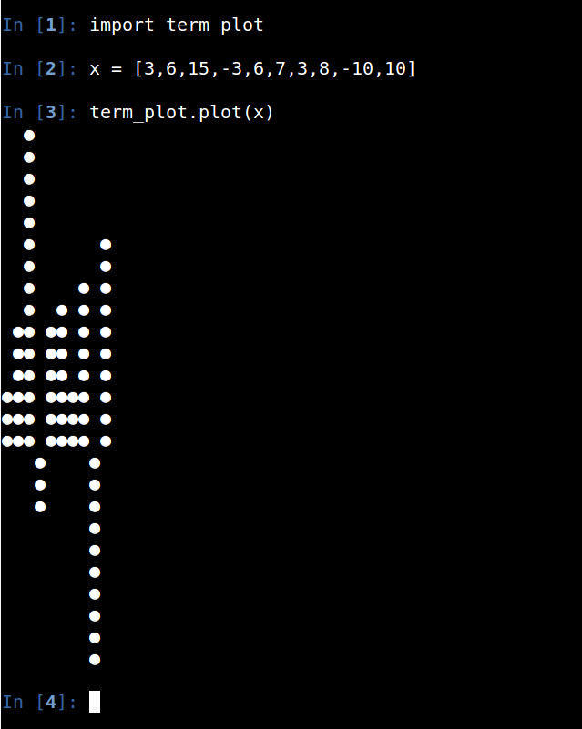
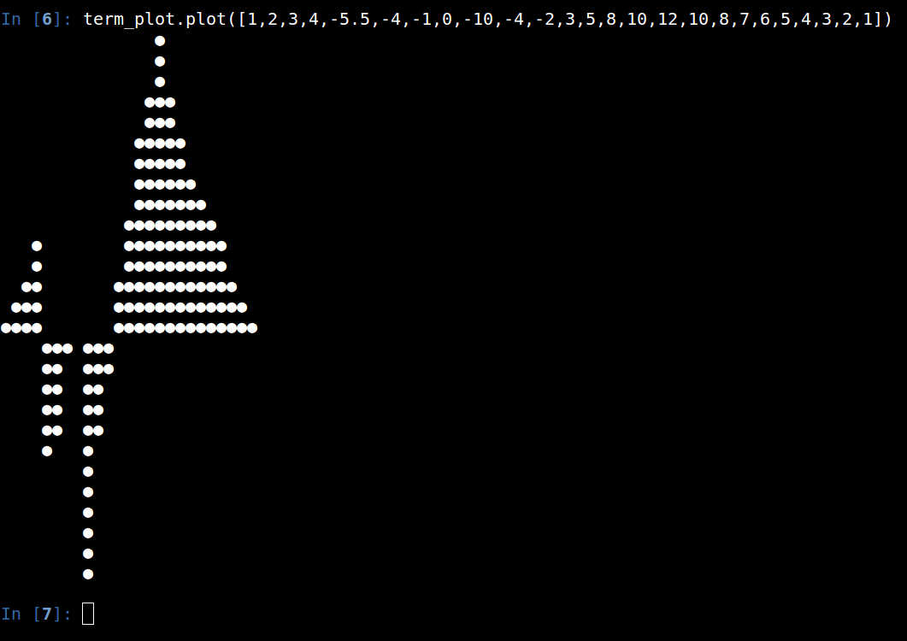
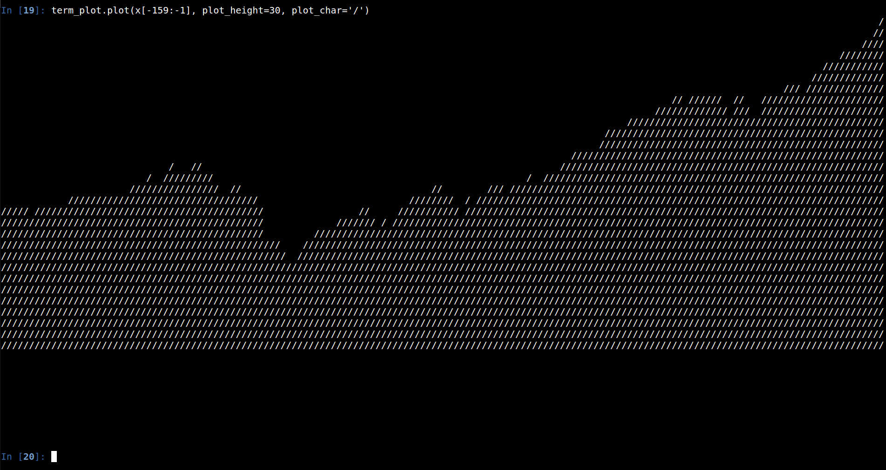

# termplot
Takes a list of numbers and creates a very basic vertical bar plot in bash. Scales data to plot_height in number of 
characters.  Number of data points should be less than the number of terminal columns or it will make an inaccurate plot 
if line wrap is enabled.

<b>Examples:</b>

<b>Previous 159 month adj closes from the S&P 500:</b>

